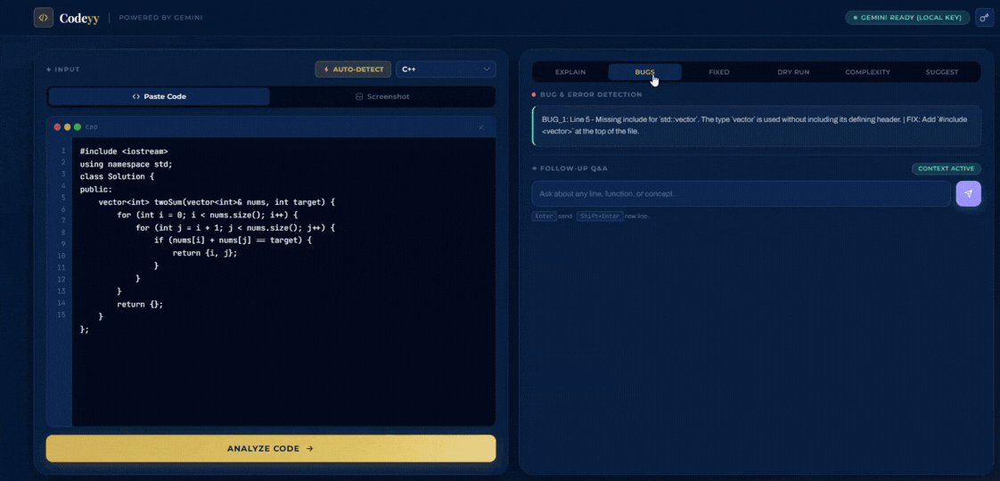
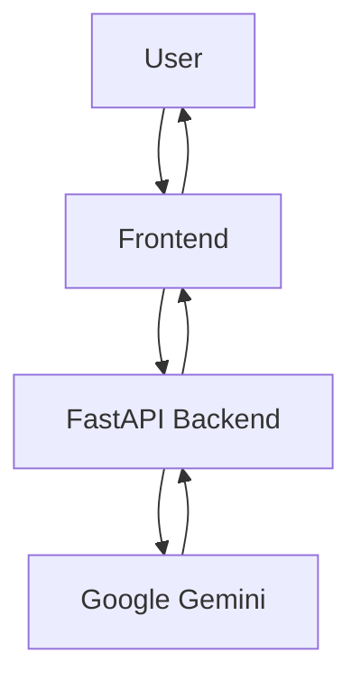

# 🚀 Codeyy

### Understand, Debug & Learn From Code Faster

Codeyy is an AI-powered code analysis platform that helps students and developers understand, debug, and learn from code through line-by-line explanations, execution tracing, complexity analysis, screenshot-to-code extraction, and contextual AI assistance.

Instead of generating code, Codeyy focuses on helping users understand how code actually works.

---

## 🎥 Demo

---

## 🌐 Live Demo

🔗 **Try Codeyy:** https://codeyy-gamma.vercel.app/

---

## 🔥 What Makes Codeyy Different?

Unlike traditional AI chatbots, Codeyy combines code understanding, debugging, execution tracing, and learning-focused analysis into a single workflow.

Instead of simply generating answers, it helps users understand how code works through:

- Line-by-line explanations
- Interactive execution tracing
- Bug detection and fixes
- Complexity analysis
- Screenshot-to-code extraction
- Context-aware follow-up discussions

Built for students, learners, and developers who want to understand code, not just generate it.

---

## ✨ Features

| Feature                     | Description                                              |
| --------------------------- | -------------------------------------------------------- |
| 📝 Line-by-Line Explanation | Understand what every line of code does in plain English |
| 🐞 Bug Detection            | Identify errors and receive suggested fixes              |
| ⚡ Complexity Analysis       | Generate Time and Space Complexity insights              |
| 🔍 Execution Trace          | Follow variable changes step-by-step                     |
| 📸 Screenshot Analysis      | Extract and analyze code directly from images            |
| 🤖 Context-Aware Chat       | Ask follow-up questions about analyzed code              |
| 🌎 Multi-Language Support   | Analyze code across multiple programming languages       |

---

## 🎯 Why Codeyy?

Reading code is often harder than writing it.

Whether you're learning a new language, preparing for interviews, debugging assignments, or understanding someone else's project, the biggest challenge is understanding what the code is actually doing.

Codeyy helps bridge that gap with explanations, execution traces, complexity insights, and interactive analysis in one place.

---

## 🏗️ Architecture

---

## ⚔️ Challenges Faced

Building Codeyy involved solving several practical engineering challenges:

- Handling inconsistent AI responses and converting them into structured, predictable outputs.
- Maintaining reliable communication between the Vercel frontend and Render-hosted FastAPI backend.
- Resolving deployment, CORS, and environment configuration issues across different services.
- Integrating Gemini while handling API errors, rate limits, and response formatting inconsistencies.
- Building screenshot-to-code workflows that work across different image qualities and layouts.
- Supporting multiple programming languages without sacrificing analysis accuracy.
- Designing execution traces that remain easy to understand for beginners.
- Balancing response quality, speed, and API costs.
---

## 📚 Roadmap

### Upcoming

* Automatic language detection
* AI-powered code commenting
* Visual execution engine
* Interactive flowcharts
* DSA concept detection
* Interview preparation mode
* Learning dashboard
* VS Code extension

---

## 🛠️ Tech Stack

---

## ⭐ Support

If you found Codeyy useful, consider starring the repository and sharing feedback.
