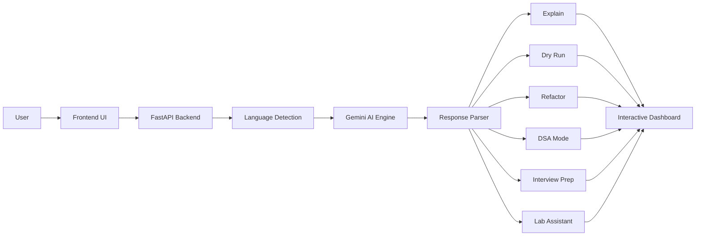

{"id":"readme-fixed","variant":"document"}

# 🚀 Codeyy | AI Code Learning Platform

### Understand Code Beyond Syntax.

Codeyy is an AI-powered platform that helps students and developers analyze, visualize, debug, and optimize code through an interactive learning experience.

It combines AI-powered code analysis, visual execution, DSA learning, interview preparation, and academic lab assistance into a single workspace. Instead of simply generating code, Codeyy explains how programs execute, identifies potential issues, recommends improvements, and helps users build a deeper understanding of programming concepts.

Whether you're learning DSA, debugging assignments, preparing for technical interviews, or completing university lab work, Codeyy transforms source code into structured, actionable insights that make programming easier to learn and understand.

---

## 🎥 Demo

.gif)

---

## 🌐 Live Demo

🔗 **Try Codeyy:** https://codeyy-gamma.vercel.app/

---

## 🔥 What Makes Codeyy Different?

Most AI coding assistants explain code or generate solutions.

Codeyy goes a step further by combining code analysis, execution visualization, DSA learning, interview preparation, and academic tools into a single platform, helping users understand not just **what** their code does, but **why** it works.

Whether you're debugging code, preparing for interviews, practicing DSA, or completing lab assignments, Codeyy keeps the entire learning workflow in one place.

---

## ✨ Features

| Module            | Capabilities                                                                                                                |
| :---------------- | :-------------------------------------------------------------------------------------------------------------------------- |
| 🧠 Explain        | Line-by-line explanations, bug detection, corrected code, complexity analysis, optimization suggestions, AI code comments.  |
| ⚡ Dry Run         | Step-by-step execution tracing, variable tracking, data structure visualization, recursion visualization, logic flowcharts. |
| 📚 DSA Learning   | DSA concept detection, algorithm explanations, LeetCode recommendations, AI-generated practice questions.                   |
| 🎤 Interview Prep | AI interviewer questions, mock technical interviews, edge case discussions, optimization challenges.                        |
| 🎓 Lab Assistant  | Algorithm generation, pseudocode, Viva Voce questions, printable Lab Report PDFs.                                           |
| 🛠 Utilities      | Screenshot-to-code, automatic language detection, multi-language support, context-aware AI chat.                            |

---

## 🎯 Why Codeyy?

Programming isn't just about writing code. It's about understanding how it executes, why it fails, and how to improve it.

Codeyy combines AI-powered analysis, visual execution, DSA guidance, interview preparation, and academic automation into a single workspace, making it easier to learn, debug, and master programming.

---

## 🏗️ Architecture

---

## ⚔️ Challenges Faced

Building Codeyy involved solving several practical product and integration challenges:

* Designing a unified workflow that combines code analysis, execution visualization, DSA learning, interview preparation, and lab assistance into a single interface.
* Structuring AI prompts and responses so each feature consistently returns predictable, well-formatted output.
* Maintaining reliable communication between the Vercel frontend and Render-hosted FastAPI backend.
* Handling Gemini API errors, rate limits, and inconsistent response formats.
* Building screenshot-to-code workflows that remain reliable across different image qualities and layouts.
* Supporting multiple programming languages while maintaining a consistent user experience.
* Designing an interface capable of presenting complex AI outputs without overwhelming users.
* Balancing response quality, latency, and API costs to keep the application responsive.

---

## 📚 Roadmap

### Upcoming

* Repository-wide code analysis
* GitHub repository import
* VS Code extension
* Learning dashboard
* Smart learning memory
* AI mentor mode
* Personalized coding roadmaps
* Project builder studio
* Placement preparation hub
* College edition
* Collaboration & team workspaces
* Analytics & insights
* Competitive coding mode
* Community platform

---

## 🛠️ Tech Stack

### Frontend

### Backend

### AI

### Deployment

---

## 🎯 Ideal For

* Computer Science Students
* DSA Learners
* Technical Interview Preparation
* Engineering Lab Practicals
* Self-Learners
* Developers exploring unfamiliar code

---

## 📄 License

Codeyy is licensed under the **GNU Affero General Public License v3.0 (AGPL-3.0)**.

You are free to use, modify, and distribute this project under the terms of the license. If you deploy a modified version as a network service, you must also make the corresponding source code available under the same AGPL-3.0 license.

See the [LICENSE](LICENSE) file for full details.

---

## ⭐ Support

If you found Codeyy useful, consider starring the repository and sharing feedback.
