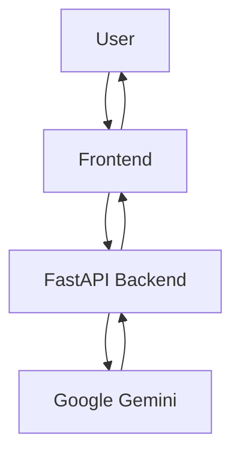

# 🚀 Codeyy

### Understand Any Codebase in Seconds

Codeyy is an AI-powered code analysis platform that helps students and developers understand, debug, and learn from code through line-by-line explanations, execution tracing, complexity analysis, screenshot-to-code extraction, and contextual AI assistance.

Instead of generating code, Codeyy focuses on helping users understand how code actually works.

---

## 🎥 Demo

---

## 🌐 Live Demo

🔗 **Try Codeyy:** (https://codeyy-gamma.vercel.app/)

---

## ✨ Features

| Feature                     | Description                                              |
| --------------------------- | -------------------------------------------------------- |
| 📝 Line-by-Line Explanation | Understand what every line of code does in plain English |
| 🐞 Bug Detection            | Identify errors and receive suggested fixes              |
| ⚡ Complexity Analysis       | Generate Time and Space Complexity insights              |
| 🔍 Execution Trace          | Follow variable changes step-by-step                     |
| 📸 Screenshot Analysis      | Extract and analyze code directly from images            |
| 🤖 Context-Aware Chat       | Ask follow-up questions about analyzed code              |
| 🌎 Multi-Language Support   | Analyze code across multiple programming languages       |

---

## 🎯 Why Codeyy?

Developers frequently encounter unfamiliar code, debugging challenges, and complex logic that can be difficult to understand quickly.

Codeyy reduces the time spent deciphering code by providing structured explanations, execution traces, and learning-focused insights in a single workflow.

---

## 🏗️ Architecture

---

## ⚔️ Challenges Faced

Building Codeyy involved solving several practical engineering challenges:

* Handling inconsistent AI outputs and ensuring analysis remained structured and readable.
* Managing communication between the Vercel frontend and Render-hosted FastAPI backend.
* Resolving deployment issues, CORS conflicts, and environment configuration problems.
* Integrating Google Gemini while handling API failures, formatting inconsistencies, and response validation.
* Building reliable screenshot-to-code workflows for different image qualities and formats.
* Supporting multiple programming languages while maintaining accurate analysis results.
* Debugging frontend-backend synchronization issues during rapid feature development.
* Managing merge conflicts and maintaining code consistency while iterating quickly.
* Improving response quality without significantly increasing analysis latency.

---

## 📚 Roadmap

### Upcoming

* Automatic language detection
* AI-powered code commenting
* Visual execution engine
* Interactive flowcharts
* DSA concept detection
* Interview preparation mode
* Learning dashboard
* VS Code extension

---

## 🛠️ Tech Stack

""Frontend" (https://img.shields.io/badge/Frontend-HTML%20%7C%20CSS%20%7C%20JavaScript-blue)"
""Backend" (https://img.shields.io/badge/Backend-FastAPI-green)"
""AI" (https://img.shields.io/badge/AI-Google%20Gemini-orange)"
""Deployment" (https://img.shields.io/badge/Deployment-Vercel%20%7C%20Render-purple)"

---

## ⭐ Support

If you found Codeyy useful, consider starring the repository and sharing feedback.
